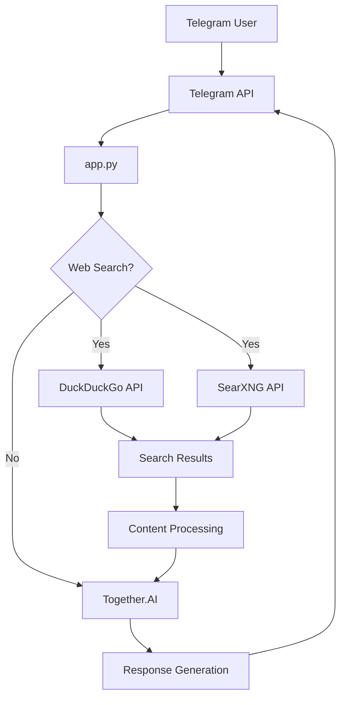

# 🌐 HacxGPT - Advanced Telegram AI Assistant

![Banner]


**HacxGPT** is a cutting-edge Telegram AI assistant that combines powerful language models with real-time web access capabilities. This versatile bot provides contextual responses, performs web searches, extracts content from webpages, and maintains conversation history for personalized interactions.

## 🌟 Key Features

### 🔍 Intelligent Web Integration
- **Dual Search Engine** (DuckDuckGo + SearXNG)
- **Webpage Content Extraction** with BeautifulSoup
- **Download Link Detection** for relevant resources
- **Real-time Information Retrieval**

### 🧠 Advanced AI Capabilities
- Powered by **Llama-3.3-70B-Instruct-Turbo** model
- Customizable system prompts for specialized responses
- Context-aware conversation history
- Rate-limited API access for stability

### ⚙️ Technical Sophistication
- State management per user
- Performance monitoring (memory, uptime, requests)
- Rate limiting with `ratelimit` library
- Error handling and resilience

### 🤖 Telegram Bot Features
- Interactive buttons for settings
- Typing indicators
- Message history management
- Status monitoring commands

## 🛠️ Installation & Setup

### Prerequisites
- Python 3.8+
- Telegram bot token
- Together.ai API key

### Installation Steps
```bash
# Clone the repository
git clone https://github.com/your-username/hacxgpt-telegram-bot.git
cd hacxgpt-telegram-bot

# Install dependencies
pip install -r requirements.txt

# Configure environment variables
cp .env.example .env
```

### Configuration (.env)
```env
TELEGRAM_TOKEN="your_telegram_bot_token"
TOGETHER_API_KEY="your_together_api_key"
MODEL_NAME="meta-llama/Llama-3.3.70B-Instruct-Turbo-Free"
```

### Running the Bot
```bash
python app.py
```

## 🎮 Usage Commands

| Command       | Description                          | Example          |
|---------------|--------------------------------------|------------------|
| `/start`      | Initialize the bot                   | `/start`         |
| `/neton`      | Enable web search                   | `/neton`         |
| `/netoff`     | Disable web search                  | `/netoff`        |
| `/clear`      | Reset conversation history          | `/clear`         |
| `/status`     | Show bot performance metrics        | `/status`        |

## 🧩 System Architecture



## 📂 Project Structure

```
hacxgpt-telegram-bot/
├── app.py               # Main application logic
├── requirements.txt     # Python dependencies
├── prompt.txt           # Custom AI system prompt
├── .env.example         # Environment configuration template
└── README.md            # Project documentation
```

## 💻 Tech Stack

- **AI Engine**: Together.AI (Llama-3.3-70B)
- **Web Framework**: Python-Telegram-Bot
- **Web Scraping**: BeautifulSoup4
- **Search APIs**: DuckDuckGo + SearXNG
- **Utilities**: Requests, Ratelimit, Python-dotenv
- **Monitoring**: Psutil

## 📈 Performance Metrics

The bot tracks several performance metrics accessible via `/status`:

- **Uptime**: Time since last restart
- **Memory Usage**: Current RAM consumption
- **Request Count**: Total messages processed
- **API Calls**: Rate-limited API usage
- **Web Search Status**: On/Off state
- **History**: Conversation message count

## ⚠️ Important Notes

1. The bot requires valid API keys for Telegram and Together.AI
2. Web search functionality can be toggled with `/neton` and `/netoff`
3. Conversation history is preserved for context but can be cleared with `/clear`
4. The system prompt can be customized in `prompt.txt`

## 📜 License

This project is licensed under the MIT License. See [LICENSE](LICENSE) for details.

---

**🌟 Star this repository if you find it useful!**  
**🐛 Report issues in the GitHub issue tracker**  
**💡 Contributions welcome!**
